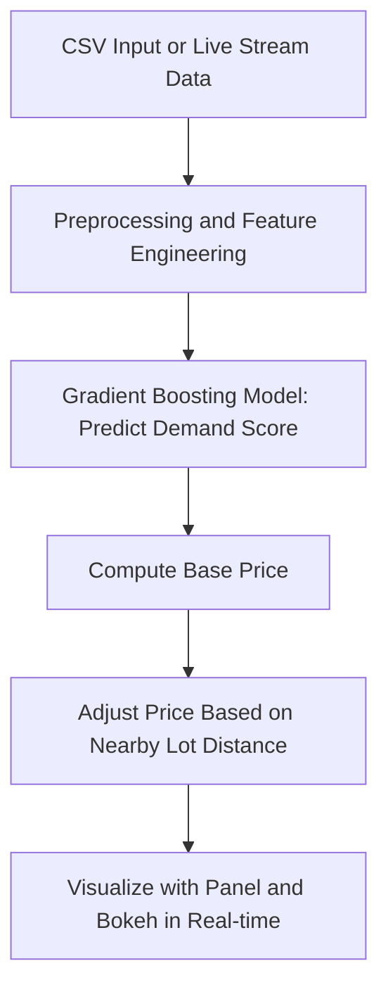
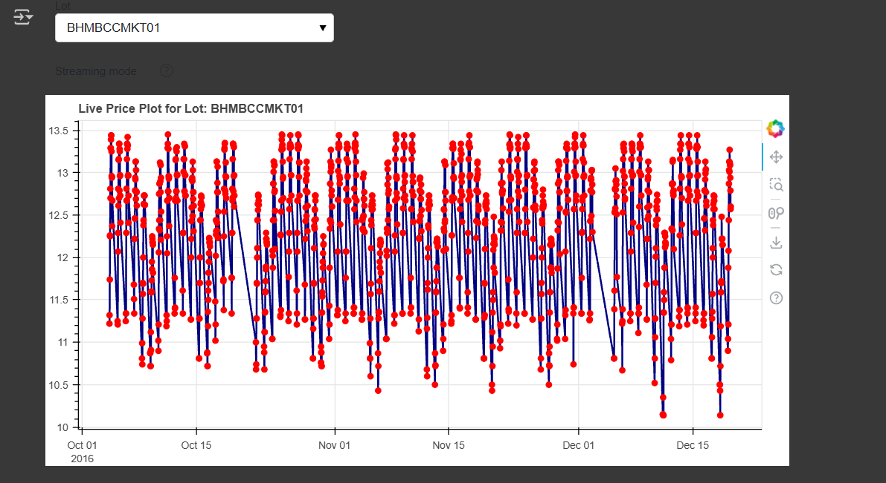

# CAPSTONE-PROJECT
#  Dynamic Urban Parking Pricing System

##  Project Overview

This project solves the problem of inefficient static pricing in urban parking systems by implementing a **real-time dynamic pricing engine**. It uses live data streams to track parking occupancy, traffic conditions, and other contextual features such as queue length, special days, and vehicle type.

A **machine learning model** is trained to predict demand, and prices are dynamically adjusted using both demand predictions and nearby parking lot competition. This approach ensures optimized pricing for both customers and parking providers.

The entire pipeline is built using:
- **Pathway** for real-time streaming,
- **Scikit-learn** for ML-based demand prediction,
- **Bokeh & Panel** for live visualization.

## 🛠 Tech Stack

| Tool / Library        | Purpose                                  |
|------------------------|-------------------------------------------|
| **Python**             | Core programming language                 |
| **Pandas / NumPy**     | Data preprocessing and manipulation       |
| **Scikit-learn**       | Machine learning model (Random Forest)    |
| **Pathway**            | Real-time stream processing engine        |
| **Joblib**             | Saving and loading ML models              |
| **Panel + Bokeh**      | Interactive visualization and dashboard   |
| **Google Colab**       | Development and execution environment     |
| **GitHub**             | Code collaboration and version control    |

## 🧩 System Architecture


## 📊 Project Workflow & Logic
1. **📥 Data Ingestion**
   - The parking dataset (`dataset.csv`) contains records of parking lot usage across timestamps.
   - We simulate a live data stream using Pathway’s `replay_csv`, which feeds data row-by-row at a configurable rate (`input_rate=500`).
   - Fields include: `Occupancy`, `Capacity`, `QueueLength`, `TrafficConditionNearby`, `VehicleType`, `IsSpecialDay`, and timestamp.

2. **🧹 Preprocessing**
   - Timestamps are parsed and sorted.
   - New temporal features are created:
     - `Hour` and `DayOfWeek` from timestamps
   - Categorical columns like `TrafficConditionNearby` and `VehicleType` are numerically encoded for ML models.
   - Latitude and longitude are retained per lot for spatial modeling.

3. **🎯 Demand Prediction (Model 5)**
   - A `GradientBoostingRegressor` is trained **offline** to predict demand using:
     - Features: `QueueLength`, `TrafficEncoded`, `IsSpecialDay`, `VehicleEncoded`, `Hour`, `DayOfWeek`
     - Target: Normalized `Occupancy / Capacity`
   - The trained model (`occupancy_predictor.pkl`) is loaded at runtime.
   - A UDF (`@pw.udf`) uses the model to predict real-time demand for each incoming row.

4. **💸 Price Computation**
   - Dynamic price is computed using:
     ```
     price = 10 * (1 + 0.5 * predicted_demand_score)
     ```
   - **Capped between ₹5 and ₹20** to ensure affordability and profit balance.
   - This makes pricing both **responsive to demand** and **bounded by business rules**.

5. **📍 Nearby Lot Adjustment**
   - If a parking lot has **2 or more lots within 500 meters**, its price is reduced by ₹0.5.
   - This encourages **competitive pricing** in dense areas.
   - Implemented using the Haversine formula on coordinates of all lots.

6. **📈 Real-Time Visualization**
   - Bokeh + Panel are used to build **interactive visual plots**.
   - You can select any parking lot from a dropdown and view its live pricing behavior over time.
   - Visual output includes a **line graph** showing price trends.

7. **🧪 Notebook Deployment & Output**
   - The system runs inside Google Colab or Jupyter using `pw.run()` and `pn.panel().servable()`.
   - Outputs are rendered inline — no need for separate server.
   - Supports production deployment via `panel serve` if needed.

## 📸 Screenshot of the Final Plot

This is the dynamic price visualization generated using Bokeh + Panel in Google Colab:


